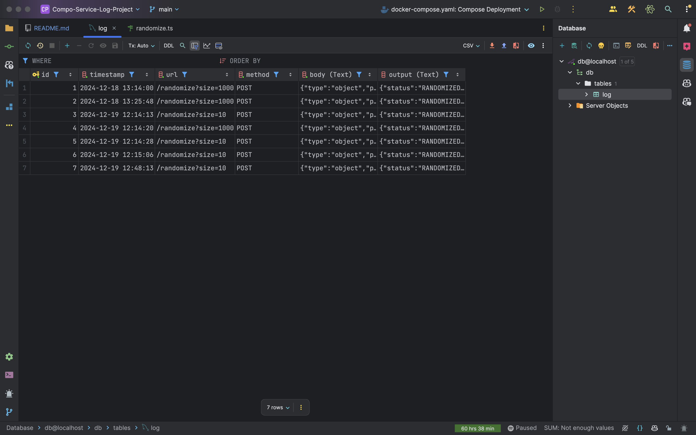
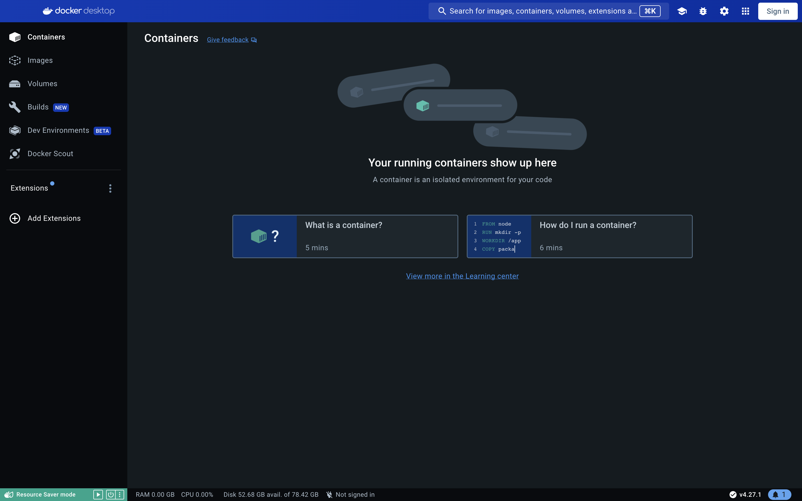
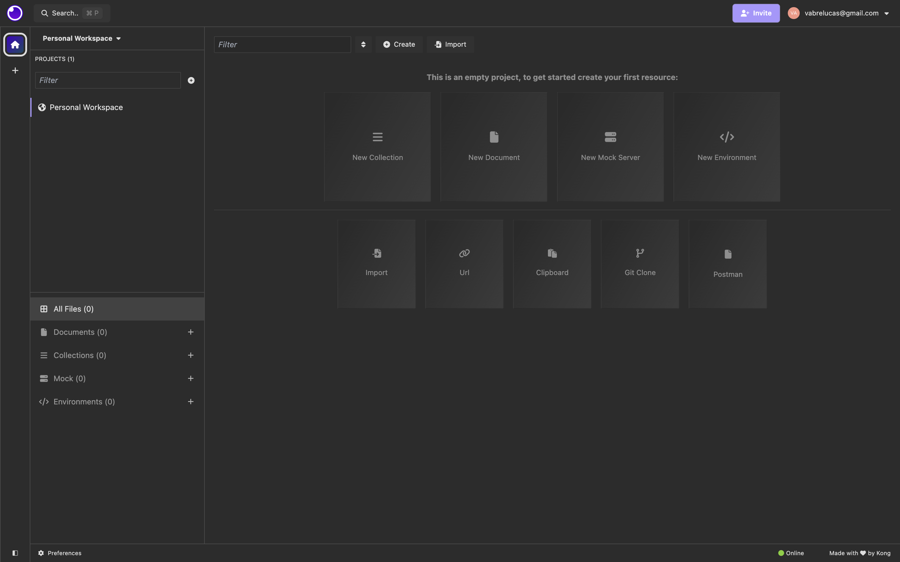
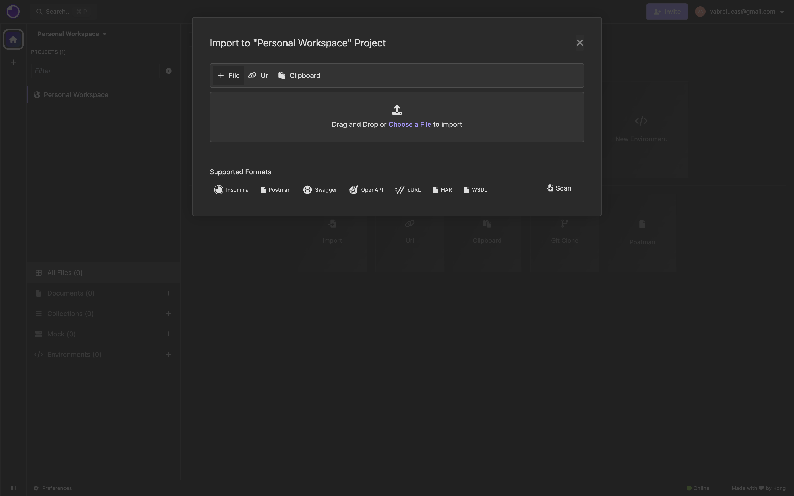
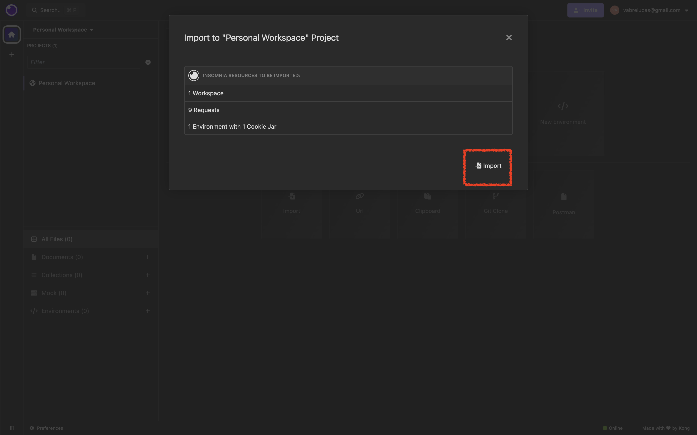
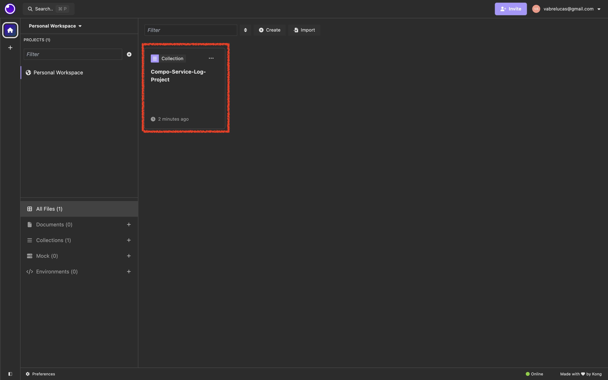
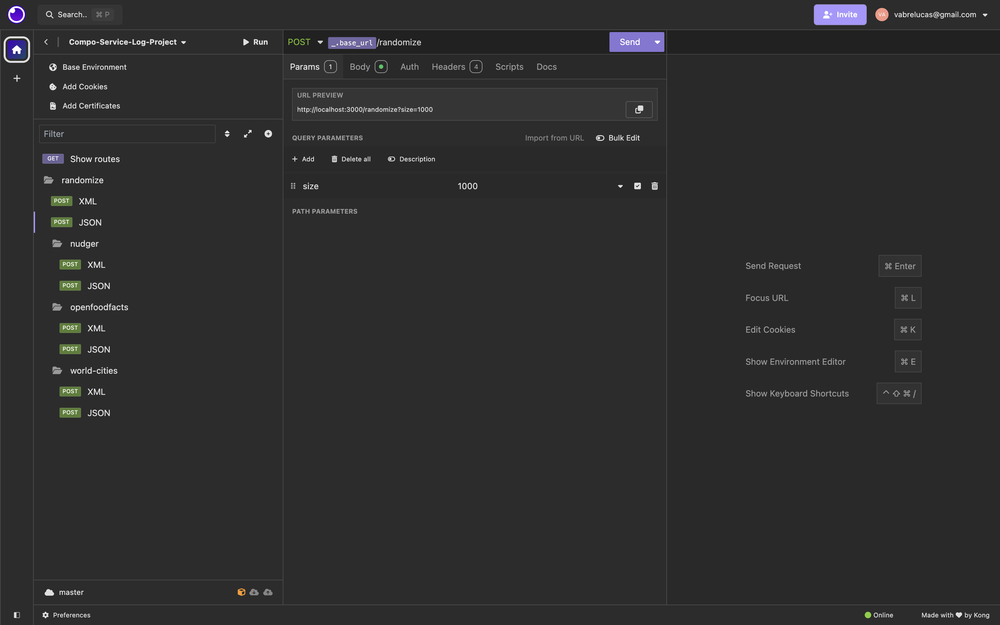
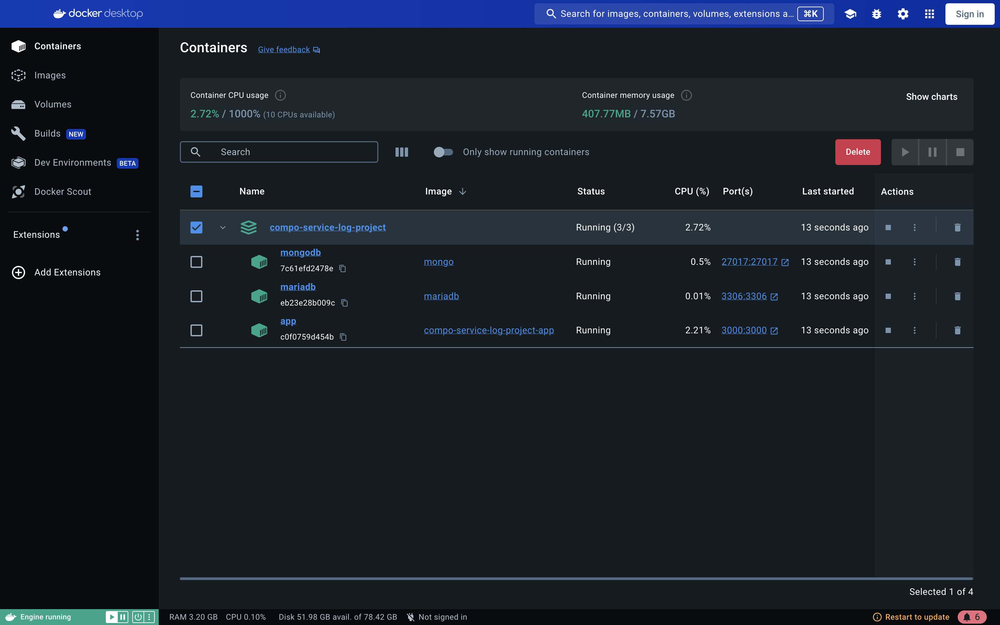
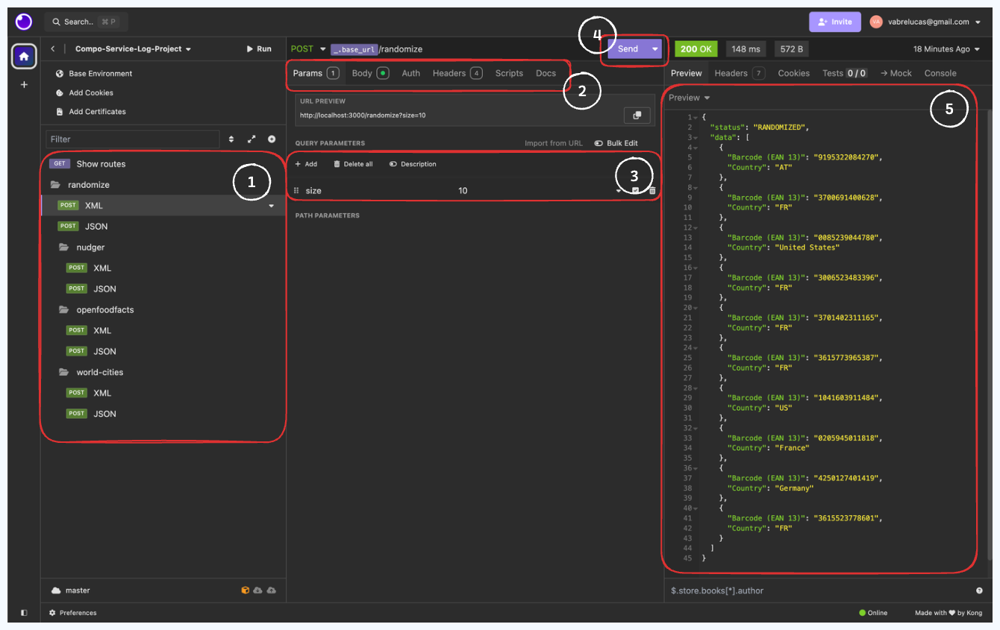
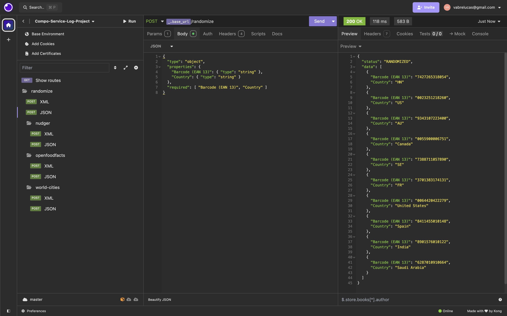

# Projet CSL

[](./LICENSE)

> Ce projet utilise les micro-services pour filtrer et collecter des données

## Prérequis

Pour pouvoir lancer ce projet vous devez avoir installé les outils suivants :

- [Docker Desktop](#installation-de-docker-desktop)
- [Insonmia](#installation-de-insomnia)

Assurez-vous d'avoir les ports `3000`, `3306` et `27017` de disponible sur votre
machine.

## Fonctionnalités

Ce projet rend accessible une API REST qui permet de filtrer et récupérer des
données.

Le téléchargement des données se fait de manière asynchrone en utilisant les WebStream de Nodes.JS.

Le projet prend en charge les archives suivantes :
- ZIP
- GZIP

Il prend également en charge les formats de données suivants :
- JSON
- CSV

Pour rendre le processus modulaire, nous avons décidé d'utiliser le Factory Pattern.
Il est donc possible d'ajouter de nouveaux services de récupération de données
en implémentant une interface.

L'API expose plusieurs routes :

- `/randomize`: Le web service général qui va venir piocher dans les autres web
  services pour récupérer des données
- `/randomize/nudger`: Le web service qui va venir récupérer des données de
  Nudger
- `/randomize/openfoodfacts`: Le web service qui va venir récupérer des données
  de OpenFoodFacts
- `/randomize/world-cities`: Le web service qui va venir récupérer des données
  de World Cities

Toutes ces routes acceptent les paramètres suivants :
- `size`: Le nombre de données à récupérer (doit être un entier > 0, par défaut 10)

Il vous faudra également fournir un fichier DMN (XML) ou un fichier JSON dans le
corps de la requête.

Lors d'une requête sur `/randomize`, une ligne de log est ajoutée dans la base mariadb.


### Installation de Docker Desktop

Docker Desktop est un outil qui permet de gérer des conteneurs Docker sur votre
machine.
Il est disponible pour Windows, MacOS et Linux.

A l'installation de Docker Desktop : Docker engine et Docker compose seront
installés.
De plus Docker Desktop installe une interface graphique pour gérer les
conteneurs.

Pour installer Docker Desktop sur votre machine vous pouvez suivre les
instructions sur le site officiel de Docker :
[https://docs.docker.com/get-docker/](https://docs.docker.com/get-docker/)

Une fois Docker Desktop installé, vous pouvez vérifier que tout fonctionne
correctement en ouvrant un terminal et en tapant les commandes suivantes :

```sh
  docker --version
``` 

```sh
docker-compose --version
```

Vous pouvez également vérifier que Docker Desktop est bien lancé en ouvrant
l'interface graphique.



### Installation de Insomnia

Insomnia est un outil qui permet de tester des API REST.
Il est disponible pour Windows, MacOS et Linux.

Pour installer Insomnia sur votre machine vous pouvez suivre les instructions
sur
le site officiel de Insomnia : https://insomnia.rest/download

Une fois Insomnia installé, vous pouvez le lancer et vous obtiendrez cette
interface :


Vous pouvez ensuite importer le fichier de test `2024-12-17.json` qui se trouve
dans le dossier `app/test/insomnia/`.

Pour cela, cliquez sur le bouton `import`


Cliquez sur `+ File` puis `Choose a file` et sélectionnez le fichier
`2024-12-17.json` et cliquez sur `open` ou `Ouvrir`.


Enfin cliquez sur `Scan` pour scanner le fichier à importer puis sur `Import`.



Et voilà vous avez importé le fichier de test ! 🎉

Une nouvelle collection est apparue, vous pouvez la sélectionner pour voir les
requêtes qui ont été importées.



## Lancer le projet

Pour lancer le projet, ouvrez votre terminal et rendez-vous à la racine du
projet.
Ensuite exécutez la commande suivante :

```sh
docker-compose up -d --build
```

Cette commande va construire les images Docker et lancer les conteneurs.
En effet, cette application contient 3 services :

- `app` : expose l'API REST (sur le port `3000`)
- `mongodb` : contient la base de données qui va stocker les données filtrées (
  sur le port `27017`)
- `mariadb`: contient la base de donnée des logs (sur le port `3306`)

Vous pouvez vérifier que les conteneurs sont bien lancés en exécutant la
commande suivante :

```sh
docker ps
```

Vous devriez voir les 3 conteneurs lancés.

```
CONTAINER ID   IMAGE                           COMMAND                  CREATED       STATUS       PORTS                    NAMES
7d90351a5dd4   compo-service-log-project-app   "docker-entrypoint.s…"   2 hours ago   Up 2 hours   0.0.0.0:3000->3000/tcp   app
f77729fee31b   mongo                           "docker-entrypoint.s…"   2 hours ago   Up 2 hours   27017/tcp                mongodb
f59177f86802   mariadb                         "docker-entrypoint.s…"   2 hours ago   Up 2 hours   0.0.0.0:3306->3306/tcp   mariadb
```

Vous pouvez également vérifier que les conteneurs sont bien lancés en ouvrant
l'interface graphique de Docker Desktop.


Il se peut que le conteneur `app` redémarre plusieurs fois avant de se
stabiliser.
Cela est dû au fait que le conteneur `app` démarre plus vite que les conteneurs
`mongodb` et `mariadb`.
Et celui-ci essaye de se connecter aux bases de données mais elles ne sont pas
encore prêtes.

## Tester l'API

Pour tester l'API rendez-vous sur Insomnia avec la collection importée et
assurez-vous que les conteneurs sont bien lancés.

### Comment fonctionne Insomnia ?

Une fois une collection de chargée, vous obtenez cette interface:

1. La liste des requêtes de la collection
2. Une fois une requête sélectionnée, vous pouvez accéder à ces détails à
   travers différents onglets
3. Le contenu de l'onglet params de la requête (ici il y a le paramètre `size`
   qui définit le nombre de données à récupérer)
4. Le bouton pour envoyer la requête
5. Le résultat de la requête



Dans l'onglet `Body` vous pouvez voir le contenu de la requête.
Vous pouvez modifier les paramètres de la requête si vous le souhaitez.

1. Vous choisissez le type de données que vous envoyez (dans cet exemple c'est
   un fichier DMN donc du XML)
2. Vous pouvez mettre le contenu de votre DMN ici


Dans le cas où vous souhaitez utiliser les schémas JSON, vous pouvez
sélectionner `JSON` à la place de `XML`
et mettre le contenu de votre JSON dans le champ `Body`.



## Vérifier les logs
Les logs API sont stockés dans la base de données MariaDB.
Pour les consulter, il suffit de s'y connecter depuis le conteneur docker mariadb. (Onglet ___Exec___ de Docker Desktop)

```sh
bash
mariadb -u user -p # le mot de passe est disponible dans le fichier .env
use db;
select * from log;
```

## Arrêter le projet

Pour arrêter le projet, ouvrez votre terminal et rendez-vous à la racine du
projet.

Ensuite, exécutez la commande suivante :

```sh
docker-compose down
```

## Auteurs

- 👤 [Kevin Mitressé](https://github.com/kmitresse)
- 👤 [Lucàs Vabre](https://github.com/LucasVbr)
